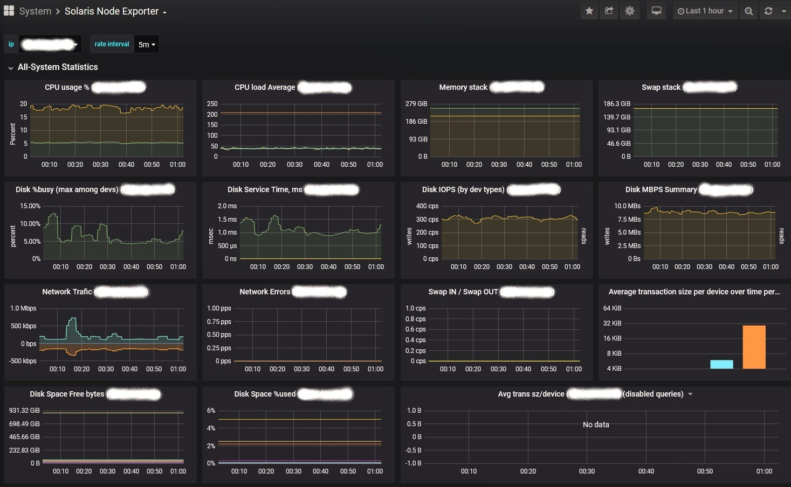
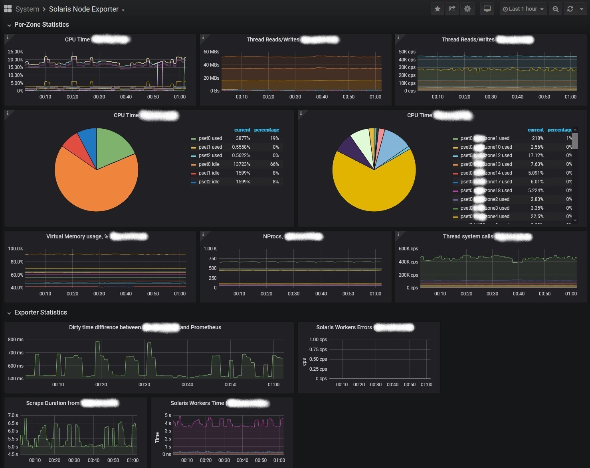

# solaris_exporter

## Description
SPARC solaris exporter for Prometheus.   
Written by Alexander Golikov for collecting SPARC Solaris metrics for Prometheus.  
Tested on Solaris 11.3.25, 11.4.4, 10u11(limited) SPARC.  
Also work on x86 platform, community-tested with Openindiana (x86) (OI-hipster-minimal-20201031.iso) and Solaris10u11. 

## versions
 - 2020 Jan 31. Initial  
 - 2020 Feb 04. Added UpTime in UpTimeCollector.  
 - 2020 Feb 09. Added DiskErrorCollector, ZpoolCollector, FmadmCollector, SVCSCollector, FCinfoCollector    
 - 2020 Dec 17. Added PrtdiagCollector, MetaStatCollector, MetaDBCollector
 - 2021 Jan 05. Added TextFileCollector, SVCSCollector now enabled for all zones (Thanks to Marcel Peter)
 - 2021 Mar 01. Fixed psutil version to 5.7.0 (something changed in the newer versions, have to time to look at)
 - 2022 Jan 24. Added support for Python 3. In testing.
 - 2022 Feb 04. Documentation update for support of Solaris 11.4.41. In testing.

## Provides info about:
  - Solaris Zones CPU Usage with processor sets info (PerZoneCpuCollector);
  - Solaris Zones Virtual Memory (SWAP) Resource Capping (PerZoneCapsCollector);
  - Common CPU stats (CpuTimeCollector);
  - Avg Load (CpuLoadCollector);
  - Disk IO (DiskIOCollector);
  - Disk Errors (DiskErrorCollector);
  - Disk Space (DiskSpaceCollector, requires 'file_dac_search' priv for solaris zones)
  - Memory Usage, swap-in, swap-out (MemCollector);
  - Network Interfaces (NetworkCollector);
  - Node time, uptime (CurTimeCollector, UpTimeCollector);
  - FC links Multipath (FCinfoCollector, /usr/sbin/mpathadm list lu)
  - System Services health via 'svcs -x' command (SVCSCollector);
  - Whole system health via 'fmadm faulty' (FmadmCollector), requires pfexec of '/usr/sbin/fmadm'.
  - Zpool devices health via 'zpool status' command (ZpoolCollector)
  - prtdiag -v return code(PrtdiagCollector)
  - Solaris Volume Manager disk status (MetaStatCollector, MetaDBCollector).
  - Get info from text files *.prom in folder provided by text_file_path var (TextFileCollector).

## Grafana dashboard.
Dashboard config is located in file grafana-dashboard-solaris.json  
Pic1

Pic2

## Installation. 
To use this exporter you need Python2.7 or Python3.x and its modules prometheus_client, psutil.
 
### Solaris 10u11:  
    # Setup proxy vars to have access to internet  
        export http_proxy=http://proxy.example.com:3128  
        export https_proxy=http://proxy.example.com:3128  
    # Install pkgutil  
        wget http://get.opencsw.org/now   
        pkgadd -d ./now   
    # Update repo list  
        /opt/csw/bin/pkgutil -U  
    # Install Python 2.7 or Python 3.3 (it works on both)  
        # Python 2.7 (preferred)  
            /opt/csw/bin/pkgutil -y -i python27  
            /opt/csw/bin/pkgutil -y -i python27_dev  
            /opt/csw/bin/pkgutil -y -i py_pip  
            /usr/sbin/pkgchk -L CSWpy-pip               # list installed files if you need  
        # or Python 3.3  
            /opt/csw/bin/pkgutil -y -i python33  
            /opt/csw/bin/pkgutil -y -i python33_dev  
            # pip3 is not included in pkgutil, we need to install it by hands  
            # download pip3.3 installer [https://bootstrap.pypa.io/pip/3.3/get-pip.py] and run it with python3.3  
            /opt/csw/bin/python3.3 get-pip.py  
    # Install gcc5core  
        /opt/csw/bin/pkgutil -y -i gcc5core  
    # Install Python module prometheus_client  
        # Python 2.7  
            /opt/csw/bin/pip2.7 install prometheus_client  
        # or Python 3.3  
            /opt/csw/bin/pip3.3 install prometheus_client  
    # Install Python module psutil, it have to compile some libs, but we preinstalled all that needed  
        ln -s /opt/csw/bin/gcc-5.5 /opt/csw/bin/gcc-5.2  
        # Python 2.7  
            # note that the latest version of psutil not supports Python2.7,  
            # that is why version of psutil is fixed to '5.7.0'  
                /opt/csw/bin/pip2.7 install psutil==5.7.0  
        # or Python 3.3  
            /opt/csw/bin/pip3.3 install psutil  
    # Run exporter, check http://ip:9100  
        # Python 2.7  
        export LANG=C  
        /opt/csw/bin/python2.7 solaris_exporter.py  
        # or Python 3.3  
        export LANG=C  
        /opt/csw/bin/python3.3 solaris_exporter.py  
 
 
#### Solaris 11.4.4 (this way works with Python 2.7):  
    # Setup proxy vars to have access to internet  
        export http_proxy=http://proxy.example.com:3128  
        export https_proxy=http://proxy.example.com:3128  
    # Install Python 2.7 module prometheus_client  
        pip-2.7 install prometheus_client  
    # Install Python 2.7 module psutil, it have to compile some libs  
    # Also you could get psutil for Python 2.7 via 'pkg install library/python/psutil-27',  
    # but it returns wrong Network statistics, tested from Solaris 11.4.4 repo.  
    # The latest version of psutil not supports Python2.7, that is why version of psutil is fixed on '5.7.0'  
        pkg install pkg:/developer/gcc/gcc-c-5  
        ln -s /usr/bin/gcc /usr/bin/cc  
        export CFLAGS=-m32  
        pip-2.7 install psutil==5.7.0  
        # if you have troubeles with compilation, try to switch to gcc-c-5 and Python 3.7   
    # Run exporter, check http://ip:9100  
        export LANG=C  
        python2.7 solaris_exporter.py  
 
 
#### Solaris 11.4.41 (this way works with Python 3.7):  
    # Setup proxy vars to have access to internet  
            export http_proxy=http://proxy.example.com:3128  
            export https_proxy=http://proxy.example.com:3128  
    # Install Python 3.7 module prometheus_client  
            pip-3.7 install prometheus_client  
    # Install Python 3.7 module psutil  
    # Also you could get psutil for Python 3.7 via 'pkg install library/python/psutil-37',  
    # but its old version '5.6.7' not adapted for Sol11.4.41 changes, it fails at 'swap -l' output.  
    # The best way is to install actual version of psutil (tested on '5.9.0')   
        pkg install pkg:/developer/gcc/gcc-c-9  
        ln -s /usr/bin/gcc /usr/bin/cc  
        pip-3.7 install psutil==5.9.0  
    # Run exporter, check http://ip:9100  
        export LANG=C  
        python3.7 solaris_exporter.py  

## SMF, Roles, Deployment. 
 - Create user and group '**monitor**'
 - Run **'./solaris_exporter_smf.sh'** to create '**prometheus/solaris_exporter**' service.
 - The best way to do all installation tasks on all nodes is Ansible. See tasks file install_solaris_exporter.yml as an example for creating role. You have to create Role and add all declared variables to it.
 
 
## Prometheus configuration
    rule_files:
       - 'alerts.solaris.yml'
    scrape_configs:
      - job_name: 'solaris_exporter'
        scrape_interval: 60s
        scrape_timeout:  50s
        metrics_path: /
        scheme: http
        file_sd_configs:
          - files:
            - 'inventory/static/hosts.yml'
            - 'inventory/static/hosts/*.yml'
            - 'inventory/dynamic/solaris/*.yml'
        relabel_configs:
          - source_labels: [os]                      #force this job if os label is 'solaris'
            regex: '^solaris.*'
            target_label: jobs
            replacement: solaris_exporter
          - source_labels: [jobs]                    #pick up config if it has 'solaris_exporter' in comma-separated list in label 'jobs', drop if not
            regex: '(.*,|^)solaris_exporter(,.*|$)'
            action: keep
          - regex: '^jobs$'                          #drop unused label 'jobs'
            action: labeldrop
          - source_labels: [__address__]             #save ip address into 'ip' label
            regex: '(.*)(:.*)?'
            replacement: '$1'
            target_label: ip
          - source_labels: [__address__]             #add port if it is absent in target, save ip:port to '__param_target' label
            regex: (.*)(:.*)?
            replacement: ${1}:9100
            target_label: __param_target
          - source_labels: [__param_target]          #copy '__param_target' label to 'instance' label
            target_label: instance
          - source_labels: [__param_target]          #copy '__param_target' label to '__address__' label
            target_label: __address__
